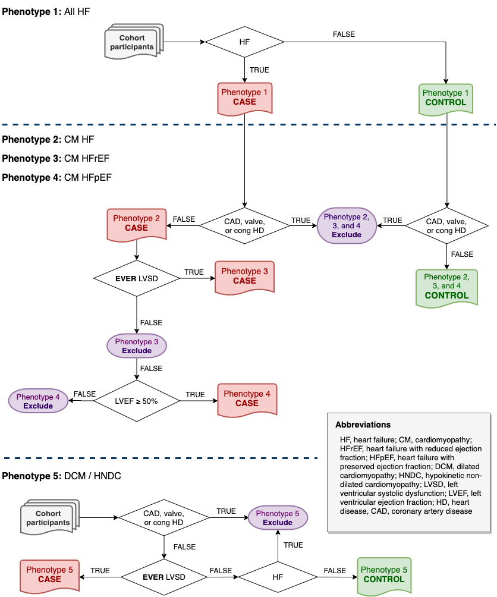

# ukb-hf-phenotyping
Heart failure phenotyping algorithm implemented in UK Biobank.

This repository contains methods and codes to implement phenotyping algorithm to define heart failure (HF) cases and its subtypes in UK Biobank cohort.
The algorithm will define five subphenotypes of HF as illustrated in the following diagram:



#### Phenotype definition

| Abbreviation           | Description                                                     |
|------------|-----------------------------------------------------|
| All HF     | Clinical syndrome of heart failure (HF) of any cause or manifestation |
| CM HF      | HF excluding coronary artery diseases (CAD), valvular or congenital heart diseases (HD)         |
| CM HFrEF   | HF with reduced ejection fraction (EF), excluding CAD, valvular or congenital HD      |
| CM HFpEF   | HF with preserved EF, excluding CAD, valvular or congenital HD      |
| DCM / HNDC | Dilated cardiomyopathy / hypokinetic non-dilated cardiomyopathy    |

## Description

The algorithm consists of two-steps phenotyping, embedded into a simple [snakemake workflow](https://snakemake.readthedocs.io/en/stable/) as detailed below.

### Step 1

The first step of the workflow uses ICD-10 and OPCS4 codes available in record-level hospital episode stastics (HES) inpatient diagnoses dataset (UKB data-field ID [412324](http://biobank.ndph.ox.ac.uk/ukb/field.cgi?id=41234)), HES inpatient operations dataset ([41149](http://biobank.ndph.ox.ac.uk/ukb/field.cgi?id=41149)), and primary cause of death from death register ([40001](http://biobank.ndph.ox.ac.uk/ukb/field.cgi?id=40001)) to define phenotype classifiers needed for step 2 phenotyping.

Code list for each phenotype classifier are available as tab-separated text files stored in `resources/code_list/<classifier>.tsv`, which include the following diseases/conditions:

| Abbreviation / Filename | Description                           |
|-------------------------|---------------------------------------|
| HF                      | Heart failure                         |
| MI                      | Myocardial infarction                 |
| LVSD                    | Left ventricular systolic dysfunction |
| congHD                  | Congenital heart disease              |
| valveHD                 | Valvular heart disease                |
| AF                      | Atrial flutter or fibrillation        |

For each phenotype classifier, diagnosed case is defined as **presence of *any* code in *any* data source.**

**Note**: Death register is not used as data source for defining heart failure cases due to common misclassification of HF as cause of death in practice. This behaviour can be changed by configuring `step1_pheno_data` variable in `config.yaml`


### Step 2

The second step uses phenotype classifiers from step 1 and LV ejection fraction data, e.g. from automated LVEF reading (data field [22420](http://biobank.ndph.ox.ac.uk/ukb/field.cgi?id=22420)), to define the five target phenotypes using a decision-tree style boolean logic algorithm mimicking the diagram above.

As this algorithm is mainly designed for case-control study, will classify each UKB participant into one of three possible categories: *case*, *control*, or *exclude* (should be excluded from analysis) for each phenotype.


## User guide

The recommended steps to reproduce the results are as follows:
1. [Install `snakemake`](https://snakemake.readthedocs.io/en/stable/getting_started/installation.html)
2. Clone this repository to local machine and change the working directory:

    ```
    git clone https://github.com/Hermes-consortium/ukb-hf-phenotyping.git
    cd ukb-hf-phenotyping
    ```
3. Place the required datasets (or create a symbolic link referring to the actual path) under `resources/data` following this structure:

```
└── resources
    └── data
        ├── hesin_diag.txt      # HES inpatient diagnoses
        ├── hesin_oper.txt      # HES inpatient operations
        ├── death_cause.txt     # Death register cause of death
        └── lvef.txt            # LV ejection fraction data
```

4. Execute the workflow:

    `snakemake -pj1`

This will produce a tab-separated text file with all phenotype status for both step 1 and step 2 phenotypes, stored in `results/ukb_hf_pheno.txt`

### Output file data dictionary

| Column(s)                    | Description                                                                     | Data type / possible value             |
|------------------------------|---------------------------------------------------------------------------------|----------------------------------------|
| eid                          | UK Biobank encrypted participant ID                                             | integer (as specified by UK Biobank)   |
| MI, LVSD, AF, HF, congHD, valveHD | Phenotype classifiers for step 1 (see Step 1 table)                             | 0 (no diagnosis) or 1 (with diagnosis) |
| secondaryHF                  | Presence of any of possible secondary HF aetiologies (LVSD, congHD, or valveHD) | 0 (no diagnosis) or 1 (with diagnosis) |
| lvef                         | LV ejection fraction                                                            | continuous                             |
| pheno{1,2,3,4,5}             | Phenotypes from step 2 (see Step 2 table)                                       | case, control, or exclude              |

### Further notes
1. This workflow was developed using R (v4.0.2) with [`tidyverse`](https://www.tidyverse.org/) and [`vroom`](https://vroom.r-lib.org/reference/vroom.html) packages.
If not availabe locally, this workflow can be executed using `conda` package manager with the following command:

    `snakemake -pj1 --use-conda`

    This will create an isolated conda environment with minimal software requirements as specified in the `workflow/envs/r.yaml` which will be used to execute the workflow.

    Note that this requires a local [installation of `conda`](https://docs.conda.io/projects/conda/en/latest/user-guide/install/index.html)

2. Most file and column names used in this workflow are configurable via the `config.yaml` file. Please adjust the settings to match with the local environment.

3. The core components of the phenotyping algorithm are the two R scripts `workflow/scripts/pheno_step1.R` and `workflow/scripts/pheno_step2.R`.
It is possible to modify and execute the scripts interactively to get the results.

4. By default, this workflow only includes participants with HES data available.
Participant with no LVEF / cardiac imaging data will be labelled as `NA` in the result file in `lvef` column and labelled as `exclude` in `pheno4` column. 

5. For comparison and sanity check, an example short report with case count for each phenotype using automated LVEF measure is provided in [`notebook/desc_stats.ipynb`](notebook/desc_stats.ipynb)
